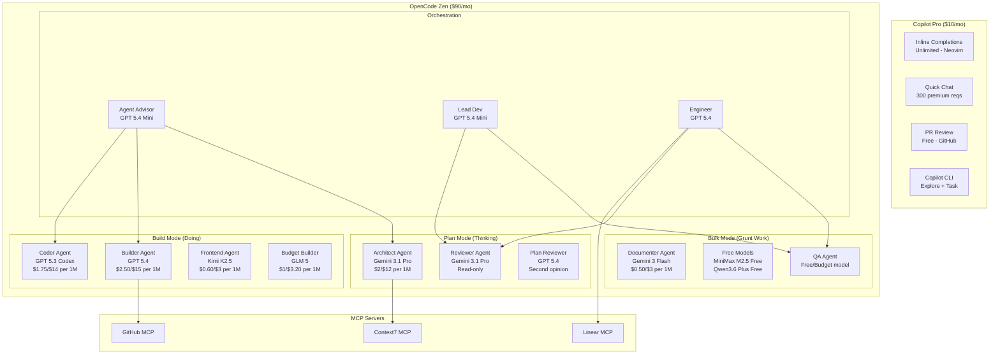

## Architecture Plan: OpenCode + Copilot Pro — Model Routing Implementation

**Created:** 2026-04-03
**Author:** Planning Agent
**Status:** Implemented — Pending Validation

---

### 1. Overview

**Problem Statement:**
The devkit currently uses Claude (Opus 4.6, Sonnet 4.5) and older Google models (Gemini 2.5 Flash Lite, Gemini 3 Flash Preview) for all OpenCode agents. With a shift to personal projects on OpenCode + Zen credits ($90/mo) and Copilot Pro ($10/mo) for lightweight work, the agent system needs to be restructured around a $100/mo budget with proper model routing: expensive models for thinking, cheap models for doing, free models for grunt work.

**Proposed Solution:**
Restructure the agent system into a layered model routing architecture:
- **Plan Mode (Thinking):** Gemini 3.1 Pro (default planner) — read-only, architecture, debugging
- **Build Mode (Doing):** GPT 5.4 (default builder) / GPT 5.3 Codex (autonomous loops) — full access
- **Bulk Mode (Grunt):** Free models (MiniMax M2.5 Free, Qwen3.6 Plus Free) — tests, docs, boilerplate
- **Lightweight:** Copilot Pro for inline completions, quick chat, PR review, CLI tasks

**Success Criteria:**

- [ ] All agents use appropriate model tier (thinking/doing/bulk)
- [ ] Cross-model review enforced (different model reviews than wrote)
- [ ] MCP servers configured for GitHub, Context7, Linear
- [ ] Budget tracking via tokenscope plugin
- [ ] No Claude model dependencies for personal projects
- [ ] Agent-advisor updated to route based on new strategy
- [ ] Documentation reflects new setup

---

### 2. Architecture Diagram



---

### 3. Current State vs Target State

| Agent | Current Model | Target Model | Rationale |
|-------|--------------|--------------|-----------|
| `agent-advisor` | `anthropic/claude-sonnet-4-5` | `opencode/gpt-5.4-mini` | Routing decisions are lightweight |
| `planning-agent` | `anthropic/claude-opus-4-6` | `opencode/gemini-3.1-pro` | Best planner. 1M context, $2/$12 |
| `engineer` | `anthropic/claude-opus-4-6` | `opencode/gpt-5.4` | Default builder. Best Go/TS |
| `lead_dev` | `google/gemini-2.5-flash-lite` | `opencode/gpt-5.4-mini` | Lightweight orchestrator upgrade |
| `reviewer` | `google/gemini-3-flash-preview` | `opencode/gemini-3.1-pro` | Cross-model review (different from builder) |
| `security` | `google/gemini-3-flash-preview` | `opencode/gemini-3.1-pro` | Needs reasoning depth for audits |
| `qa` | `google/gemini-3-flash-preview` | `opencode/minimax-m2.5-free` | Tests are grunt work, use free |
| `test_generator` | *(not specified)* | `opencode/minimax-m2.5-free` | BDD generation is bulk work |
| `docs_generator` | `google/gemini-3-flash-preview` | `opencode/gemini-3-flash` | Docs are cheap work |
| `commit` | `google/gemini-2.5-flash-lite` | `opencode/gpt-5.4-nano` | Git ops are trivial |
| `linear` | `google/gemini-3-flash-preview` | `opencode/gpt-5.4-mini` | Project management needs structure |
| `plan-reviewer` | *(not specified)* | `opencode/gpt-5.4` | Cross-model: reviews Gemini plans |

**New Agents to Create:**

| Agent | Model | Mode | Purpose |
|-------|-------|------|---------|
| `architect` | `opencode/gemini-3.1-pro` | subagent, read-only | System design, migration plans. Replaces planning-agent role with updated model. |
| `builder` | `opencode/gpt-5.4` | subagent, full access | Default implementation. Go/TS code. |
| `coder` | `opencode/gpt-5.3-codex` | subagent, full access | Autonomous test-fix loops. Spec-driven. |
| `frontend` | `opencode/kimi-k2.5` | subagent, full access | UI/vision-to-code. Screenshots as input. |
| `budget-builder` | `opencode/glm-5` | subagent, full access | Well-defined tasks at 30% cost of GPT 5.4. |

---

### 4. Implementation Steps

| # | Task | Complexity | Dependencies | Parallelizable |
|---|------|-----------|--------------|----------------|
| 1 | Create `opencode.json` project config | M | None | Yes |
| 2 | Create new agents (architect, builder, coder, frontend, budget-builder) | M | None | Yes |
| 3 | Update existing agents with new models | M | None | Yes |
| 4 | Update agent-advisor routing logic | M | Steps 2-3 | No |
| 5 | Update agent README.md | S | Steps 2-4 | No |
| 6 | Update brewfile (add copilot-cli) | S | None | Yes |
| 7 | Add Copilot integration notes to CLAUDE.md/README | S | None | Yes |
| 8 | Add cost management script | S | None | Yes |

---

### 5. Detailed Steps

#### Step 1: Create `opencode.json` Project Config

**What:** Create the root OpenCode configuration file with model routing, MCP servers, and plugin declarations.

**Why:** Central config for model defaults, Plan vs Build mode agents, MCP server connections, and cost controls.

**File:** `/home/user/devkit/opencode.json`

**Key sections:**
- `provider` — Model provider configurations with API keys (env vars)
- `agent.plan` — Default Plan mode model (Gemini 3.1 Pro)
- `agent.build` — Default Build mode model (GPT 5.4)
- `mcp` — MCP server declarations (GitHub, Context7, Linear)
- `plugins` — tokenscope for cost tracking
- `models.disabled` — Claude models, GPT 5.4 Pro, older GPT variants

**Acceptance:** OpenCode CLI reads config and routes to correct models.

---

#### Step 2: Create New Agents

**What:** Create 5 new agent definition files following existing markdown frontmatter format.

**Why:** Implements the subagent architecture from the routing guide — specialized agents with specific models and permissions.

**Files to create:**
- `opencode/aig_agents/architect.md` — Gemini 3.1 Pro, read-only
- `opencode/aig_agents/builder.md` — GPT 5.4, full access
- `opencode/aig_agents/coder.md` — GPT 5.3 Codex, full access (autonomous loops)
- `opencode/aig_agents/frontend.md` — Kimi K2.5, full access (vision-to-code)
- `opencode/aig_agents/budget-builder.md` — GLM 5, full access

**Acceptance:** Each agent has proper YAML frontmatter, clear persona, constraints, and output format.

---

#### Step 3: Update Existing Agents with New Models

**What:** Update YAML frontmatter `model:` field in all existing agents.

**Why:** Migrate from Claude/old Google models to Zen-compatible models matching the routing strategy.

**Files to modify:**
- `agent-advisor.md` — `anthropic/claude-sonnet-4-5` → `opencode/gpt-5.4-mini`
- `planning-agent.md` — `anthropic/claude-opus-4-6` → `opencode/gemini-3.1-pro`
- `engineer.md` — `anthropic/claude-opus-4-6` → `opencode/gpt-5.4`
- `lead_dev.md` — `google/gemini-2.5-flash-lite` → `opencode/gpt-5.4-mini`
- `reviewer.md` — `google/gemini-3-flash-preview` → `opencode/gemini-3.1-pro`
- `security.md` — `google/gemini-3-flash-preview` → `opencode/gemini-3.1-pro`
- `qa.md` — `google/gemini-3-flash-preview` → `opencode/minimax-m2.5-free`
- `docs_generator.md` — `google/gemini-3-flash-preview` → `opencode/gemini-3-flash`
- `commit.md` — `google/gemini-2.5-flash-lite` → `opencode/gpt-5.4-nano`
- `linear.md` — `google/gemini-3-flash-preview` → `opencode/gpt-5.4-mini`

**Acceptance:** All agents reference Zen-compatible models. No Claude model references remain.

---

#### Step 4: Update Agent Advisor Routing Logic

**What:** Rewrite the agent-advisor's decision framework to include new agents and model-routing rules.

**Why:** The advisor needs to know about architect, builder, coder, frontend, budget-builder agents and the cross-model review rule.

**Key additions:**
- Add new agents to the "Available Agents" section
- Add "Model Routing Rules" section (think → Gemini, do → GPT, grunt → free)
- Add "Cross-Model Review" rule (never review with same model that wrote)
- Add "Budget Awareness" section (prefer free models for bulk, save Zen for reasoning)
- Add Copilot delegation guidance (quick questions → Copilot, not OpenCode)
- Update decision framework with new agent options
- Add scenario routing table from the guide

**Acceptance:** Advisor correctly routes to appropriate agent/model tier for any given task.

---

#### Step 5: Update Agent README.md

**What:** Update the agent documentation to reflect all new agents, models, and workflows.

**Why:** Single reference for agent capabilities and invocation.

**Key additions:**
- New agent entries in quick reference table
- New agent detail sections
- Updated "Model Routing" section explaining the strategy
- Updated comparison tables
- Budget-aware workflow examples
- Copilot integration notes

**Acceptance:** README accurately documents all agents and the routing strategy.

---

#### Step 6: Update Brewfile

**What:** Add Copilot CLI to the Homebrew manifest.

**Why:** Copilot CLI provides free terminal agents (Explore, Task) with GPT-5 mini.

**Changes:**
- Add `gh copilot` extension or `@github/copilot` npm package reference
- Add any OpenCode plugin dependencies if needed

**Acceptance:** `brew bundle` installs all required tools including Copilot CLI.

---

#### Step 7: Add Integration Documentation

**What:** Update CLAUDE.md and main README with Copilot + OpenCode routing strategy.

**Why:** Anyone cloning the devkit needs to understand the two-tool setup.

**Acceptance:** Documentation explains the strategy, setup steps, and cost management.

---

#### Step 8: Add Cost Management Script

**What:** Create a helper script for Zen budget tracking and model usage summary.

**Why:** Zen's dashboard is basic. A local script helps track spend.

**File:** `scripts/opencode-budget.sh`

**Acceptance:** Script shows current session costs and model usage breakdown.

---

### 6. Cross-Model Review Rule (Critical)

This is a core architectural principle from the routing guide:

> **Never review code with the same model that wrote it. Blind spots compound.**

| Wrote Code | Review With |
|-----------|-------------|
| GPT 5.4 (Builder) | Gemini 3.1 Pro (Reviewer) |
| GPT 5.3 Codex (Coder) | Gemini 3.1 Pro (Reviewer) |
| Gemini 3.1 Pro (Architect plan) | GPT 5.4 (Plan Reviewer) |
| GLM 5 (Budget Builder) | Gemini 3.1 Pro (Reviewer) |
| Kimi K2.5 (Frontend) | Gemini 3.1 Pro (Reviewer) |

This is enforced by:
1. Reviewer agent always using Gemini 3.1 Pro
2. Plan-reviewer always using GPT 5.4
3. Agent-advisor recommending the correct review chain

---

### 7. MCP Server Configuration

| Server | Scope | When Loaded | Context Cost |
|--------|-------|-------------|--------------|
| GitHub | Global | Always | Low |
| Context7 | Per-project | When using unfamiliar APIs | Medium |
| Linear | Per-project | When managing issues | Medium |
| Filesystem | Per-project | Cross-repo work only | Low |
| Database | Per-session | Active data debugging only | High |

**Best practices:**
- Keep global MCP list to 2-3 servers max
- Use large-context models (Gemini 3.1 Pro, GPT 5.4) when multiple MCPs active
- Prefer Context7 over model training data for library docs

---

### 8. Monthly Budget Allocation

| Task | Model | % Work | Est. Cost | Tool |
|------|-------|--------|-----------|------|
| Inline completions | Copilot built-in | 30% | $0 | Copilot |
| Quick chat / small tasks | Copilot models | 10% | $0 | Copilot |
| PR review | Copilot review | 5% | $0 | Copilot |
| Architecture / planning | Gemini 3.1 Pro | 10% | ~$15 | OpenCode |
| Implementation | GPT 5.4 / Codex | 25% | ~$40 | OpenCode |
| Budget implementation | GLM 5 / Kimi K2.5 | 10% | ~$10 | OpenCode |
| Code review (deep) | Gemini 3.1 Pro | 5% | ~$8 | OpenCode |
| Tests / docs / bulk | Free models | 5% | $0 | OpenCode |
| Buffer | Various | | ~$17 | OpenCode |
| **TOTAL** | | **100%** | **~$100** | |

---

### 9. Risks & Mitigations

| Risk | Likelihood | Impact | Mitigation |
|------|-----------|--------|------------|
| OpenCode config format differs from assumed | Medium | High | Research actual docs first; use existing agent format as baseline |
| Model IDs change or aren't available on Zen | Medium | Medium | Use configurable model IDs; document how to swap |
| Free models produce lower quality for tests | Medium | Low | Fallback to paid MiniMax M2.5 ($0.30/$1.20) |
| MCP servers consume too much context on 200K models | Low | Medium | Only use MCPs with 1M context models |
| Copilot CLI not available for terminal env | Low | Low | Fall back to OpenCode for all tasks |
| Cross-model review adds latency | Low | Low | Acceptable tradeoff for quality |

---

### 10. Open Questions

- [x] ~~Confirm exact OpenCode `opencode.json` schema~~ — Done. Schema at `https://opencode.ai/config.json`. Uses `type: "local"/"remote"` for MCP, `plugin` as array of npm names, `instructions` for rules.
- [x] ~~Determine if OpenCode supports Plan/Build agent mode natively~~ — Yes. Built-in `plan` and `build` primary agents with Tab switching. Per-agent model overrides supported.
- [x] ~~Check if tokenscope plugin is installable~~ — Yes. npm package `@ramtinj95/opencode-tokenscope`. Add to `plugin` array in opencode.json.
- [x] ~~Confirm Copilot CLI installation method~~ — `gh extension install github/gh-copilot` after installing `gh` via Homebrew.
- [ ] Verify model config IDs match Zen's actual model catalog (e.g., `opencode/gpt-5.4` vs `gpt-5.4`) — **Needs live testing**
- [ ] Decide whether to keep `planning-agent.md` alongside new `architect.md` or consolidate — kept both for now, different system prompts
- [ ] Symlink agents to OpenCode's expected path: `ln -sf /path/to/devkit/opencode/aig_agents ~/.config/opencode/agents`
- [ ] Symlink commands: `ln -sf /path/to/devkit/opencode/commands ~/.config/opencode/commands`

---

### 11. OpenCode Configuration Notes (from research)

**Agent paths (important):** OpenCode expects agents at `~/.config/opencode/agents/` (global) or `.opencode/agents/` (per-project). The devkit stores them at `opencode/aig_agents/`. Symlink required:

```bash
ln -sf /path/to/devkit/opencode/aig_agents ~/.config/opencode/agents
ln -sf /path/to/devkit/opencode/commands ~/.config/opencode/commands
```

**Plugin installation:** Plugins auto-install via Bun to `~/.cache/opencode/node_modules/`. Just add to `plugin` array in opencode.json.

**Permission system:** Granular control with `permission` object: `edit`, `bash`, `webfetch`, `task`, `skill` set to `ask`/`allow`/`deny`. Supports glob patterns for task delegation.

**Model switching:** Built-in `plan` and `build` primary agents switch with Tab key. Variant cycling (reasoning effort) with keybind.

---

### 12. Next Steps

1. **Symlink:** Set up symlinks to `~/.config/opencode/agents/` and `~/.config/opencode/commands/`
2. **Validate:** Test agent routing in OpenCode with live Zen credits
3. **Verify Model IDs:** Confirm Zen model catalog matches config IDs
4. **Iterate:** Adjust models based on 2-3 weeks of usage data
5. **Consider:** Adding `permission` controls to agents (e.g., architect gets `edit: deny`, `bash: deny`)
